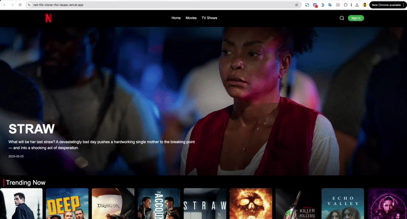

# Netflix Clone

This is a clone of the Netflix website built with Next.js, Tailwind CSS, and other modern technologies. It is a fully responsive web application that mimics the look and feel of Netflix.

## Live Demo

You can view the live demo here: [https://net-flix-clone-rho-taupe.vercel.app/](https://net-flix-clone-rho-taupe.vercel.app/)



## Features

- User authentication (sign up and sign in)
- Browse movies and TV shows
- Movie and TV show details page
- Add to watchlist
- Responsive design for all devices

## Tech Stack

- **Framework:** [Next.js](https://nextjs.org/)
- **Styling:** [Tailwind CSS](https://tailwindcss.com/)
- **UI Components:** [Shadcn/UI](https://ui.shadcn.com/)
- **Authentication:** [NextAuth.js](https://next-auth.js.org/)
- **Database:** [MongoDB](https://www.mongodb.com/) with [Mongoose](https://mongoosejs.com/)
- **Deployment:** [Vercel](https://vercel.com/)

## Getting Started

To get a local copy up and running, follow these simple steps.

### Prerequisites

- Node.js (v18.x or later)
- npm or yarn

### Installation

1.  Clone the repo
    ```sh
    git clone https://github.com/70shakeel/Netflix-clone.git
    ```
2.  Install NPM packages
    ```sh
    npm install
    ```
3.  Run the development server
    ```sh
    npm run dev
    ```

Open [http://localhost:3000](http://localhost:3000) with your browser to see the result.

You can start editing the page by modifying `app/page.js`. The page auto-updates as you edit the file.

This project uses [`next/font`](https://nextjs.org/docs/app/building-your-application/optimizing/fonts) to automatically optimize and load [Geist](https://vercel.com/font), a new font family for Vercel.

## Learn More

To learn more about Next.js, take a look at the following resources:

- [Next.js Documentation](https://nextjs.org/docs) - learn about Next.js features and API.
- [Learn Next.js](https://nextjs.org/learn) - an interactive Next.js tutorial.

You can check out [the Next.js GitHub repository](https://github.com/vercel/next.js) - your feedback and contributions are welcome!

## Deploy on Vercel

The easiest way to deploy your Next.js app is to use the [Vercel Platform](https://vercel.com/new?utm_medium=default-template&filter=next.js&utm_source=create-next-app&utm_campaign=create-next-app-readme) from the creators of Next.js.

Check out our [Next.js deployment documentation](https://nextjs.org/docs/app/building-your-application/deploying) for more details.
